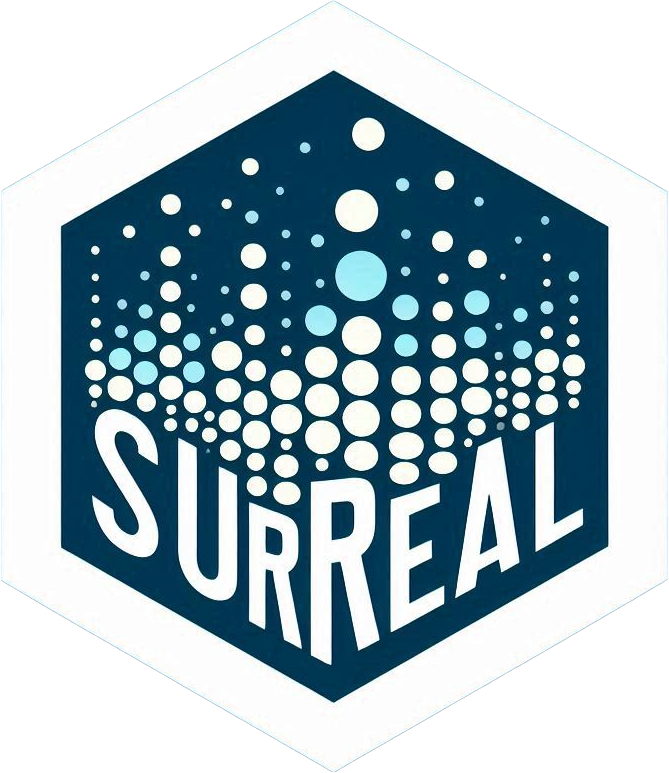

<!-- README.md is generated from README.Rmd. Please edit that file -->

```{r, include = FALSE}
knitr::opts_chunk$set(
  collapse = TRUE,
  comment = "#>",
  fig.path = "man/figures/README-",
  out.width = "100%"
)
```

# surreal 

<!-- badges: start -->
[](https://github.com/coatless-rpkg/surreal/actions/workflows/R-CMD-check.yaml)
<!-- badges: end -->

`surreal` implements the "Residual (Sur)Realism" algorithm described by 
Stefanski (2007). This package allows you to generate datasets that 
reveal hidden images or messages in their residual plots, providing a novel 
approach to understanding and illustrating statistical concepts.

## Installation

You can install the stable version of the package from
[CRAN](https://CRAN.R-project.org/package=surreal) with:

```r
install.packages("surreal")
```

If you prefer to be on the cutting-edge, you can install the development 
version of the package from [GitHub](https://github.com/) using:

``` r
# install.packages("remotes")
remotes::install_github("coatless-rpkg/surreal")
```

## Usage

First, load the package:

```{r}
#| label: load-library
library(surreal)
```

Once loaded, we can take any series of `(x, y)` coordinate positions for an image
or a text message and apply the surreal method to it. The method will create
a dataset that, when fit with a linear model, will reveal the hidden image or text.

### Importing Data

As an example, let's use the built-in R logo dataset:

```{r}
#| label: load-logo
data("r_logo_image_data", package = "surreal")

plot(r_logo_image_data, pch = 16, main = "Original R Logo Data")
```

The data for the R logo is stored in a data frame with two columns, `x` and `y`:

```{r}
#| label: logo-data-summary
str(r_logo_image_data)
summary(r_logo_image_data)
```

### Applying the Surreal Method

Now, let's apply the surreal method to the R logo data to hide it in a dataset:

```{r}
#| label: apply-surreal-method
set.seed(114)
transformed_data <- surreal(r_logo_image_data)
```

We can note that the transformed data has additional covariates that obfuscate
the original image. If we observe the transformed data by using a scatterplot
matrix graph, we can see that the new covariates do not reveal the original image:

```{r}
#| label: surreal-method-data-pair-plot
pairs(y ~ ., data = transformed_data, main = "Data After Transformation")
```

### Revealing the Hidden Image

We need to fit a linear model to the transformed data and plot the residuals:

```{r}
#| label: surreal-method-residual-plot
model <- lm(y ~ ., data = transformed_data)
plot(model$fitted, model$resid, pch = 16, 
     main = "Residual Plot: Hidden R Logo Revealed")
```

The residual plot reveals the original R logo with a slight border. This
border is automatically added to within the surreal method to enhance the
recovery of the hidden image in the residual plot.

## Creating Custom Hidden Images

You can also create datasets with custom text. Here's a quick 
example that hides a multi-line message:

```{r}
#| label: custom-text-example
text_data <- surreal_text("R\nis\nawesome!")
model <- lm(y ~ ., data = text_data)
plot(model$fitted, model$resid, pch = 16, main = "Custom Text in Residuals")
```

## References

Stefanski, L. A. (2007). "Residual (Sur)realism". *The American Statistician*, 61(2), 163-177. doi:10.1198/000313007X190079

## Acknowledgements

This package builds upon the work of [John Staudenmayer](https://www4.stat.ncsu.edu/~stefansk/NSF_Supported/Hidden_Images/000_R_Programs/John_Staudenmayer/),
[Peter Wolf](https://www4.stat.ncsu.edu/~stefansk/NSF_Supported/Hidden_Images/000_R_Programs/Peter_Wolf/), and
[Ulrike Gromping](https://www4.stat.ncsu.edu/~stefansk/NSF_Supported/Hidden_Images/000_R_Programs/Ulrike_Gromping/),
who initially brought these algorithms to R.
