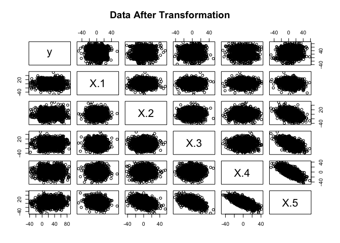
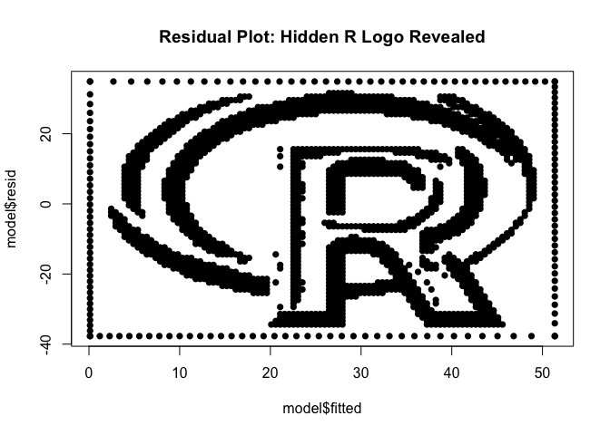

<!-- README.md is generated from README.Rmd. Please edit that file -->

# surreal 

<!-- badges: start -->

[](https://github.com/coatless-rpkg/surreal/actions/workflows/R-CMD-check.yaml)
<!-- badges: end -->

Ever wanted to hide secret messages or images in your data? That’s what
the `surreal` package does! It lets you create datasets with hidden
images or text that appear when you plot the residuals of a linear model
by providing an implementation of the “Residual (Sur)Realism” algorithm
described by Stefanski (2007).

## Installation

You can install `surreal` from CRAN:

``` r
install.packages("surreal")
```

Or get the latest version from GitHub:

``` r
# install.packages("remotes")
remotes::install_github("coatless-rpkg/surreal")
```

## Usage

First, load the package:

``` r
library(surreal)
```

Once loaded, we can take any series of `(x, y)` coordinate positions for
an image or a text message and apply the surreal method to it.

### Importing Data

As an example, let’s use the built-in R logo dataset:

``` r
data("r_logo_image_data", package = "surreal")

plot(r_logo_image_data, pch = 16, main = "Original R Logo Data")
```


The data for the R logo is stored in a data frame with two columns, `x`
and `y`:

``` r
str(r_logo_image_data)
#> 'data.frame':    2000 obs. of  2 variables:
#>  $ x: int  54 55 56 57 58 59 34 35 36 49 ...
#>  $ y: int  -9 -9 -9 -9 -9 -9 -10 -10 -10 -10 ...
summary(r_logo_image_data)
#>        x                y         
#>  Min.   :  5.00   Min.   :-75.00  
#>  1st Qu.: 32.00   1st Qu.:-57.00  
#>  Median : 57.00   Median :-39.00  
#>  Mean   : 55.29   Mean   :-40.48  
#>  3rd Qu.: 77.00   3rd Qu.:-24.00  
#>  Max.   :100.00   Max.   : -9.00
```

### Applying the Surreal Method

Now, let’s apply the surreal method to the R logo data to hide it in a
dataset. We’ll want to set a seed for reproducibility purposes since the
algorithm relies on an optimization routine:

``` r
set.seed(114)
transformed_data <- surreal(r_logo_image_data)
```

We can note that the transformed data has additional covariates that
obfuscate the original image. If we observe the transformed data by
using a scatterplot matrix graph, we can see that the new covariates do
not reveal the original image:

``` r
pairs(y ~ ., data = transformed_data, main = "Data After Transformation")
```



### Revealing the Hidden Image

We need to fit a linear model to the transformed data and plot the
residuals:

``` r
model <- lm(y ~ ., data = transformed_data)
plot(model$fitted, model$resid, pch = 16, 
     main = "Residual Plot: Hidden R Logo Revealed")
```



The residual plot reveals the original R logo with a slight border. This
border is automatically added inside the surreal method to enhance the
recovery of the hidden image in the residual plot.

## Hide Your Own Message

Want to hide your own message? You can also create datasets with custom
text:

``` r
# Generate a dataset with a hidden message across multiple lines
message_data <- surreal_text("R\nis\nawesome!")

# Reveal the hidden message
model <- lm(y ~ ., data = message_data)
plot(model$fitted, model$resid, pch = 16, 
     main = "Custom Message in Residuals")
```


## References

Stefanski, L. A. (2007). “Residual (Sur)realism”. *The American
Statistician*, 61(2), 163-177. <doi:10.1198/000313007X190079>

## Acknowledgements

This package is based on Stefanski (2007) and builds upon earlier R
implementations by [John
Staudenmayer](https://www4.stat.ncsu.edu/~stefansk/NSF_Supported/Hidden_Images/000_R_Programs/John_Staudenmayer/),
[Peter
Wolf](https://www4.stat.ncsu.edu/~stefansk/NSF_Supported/Hidden_Images/000_R_Programs/Peter_Wolf/),
and [Ulrike
Gromping](https://www4.stat.ncsu.edu/~stefansk/NSF_Supported/Hidden_Images/000_R_Programs/Ulrike_Gromping/).
