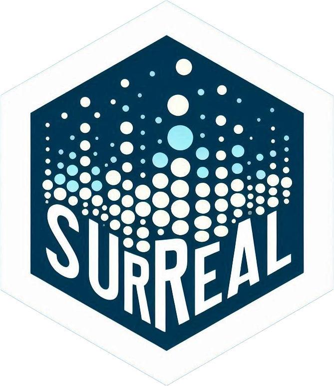
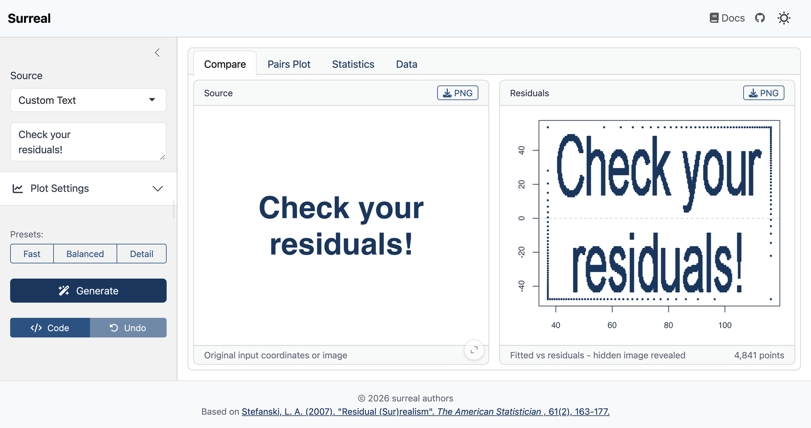

<!-- README.md is generated from README.qmd. Please edit that file -->

# surreal 

<!-- badges: start -->
[](https://github.com/coatless-rpkg/surreal/actions/workflows/R-CMD-check.yaml)
<!-- badges: end -->

Ever wanted to hide secret messages or images in your data? That's what the 
`surreal` package does! It lets you create datasets with hidden images or text 
that appear when you plot the residuals of a linear model by providing an
implementation of the "Residual (Sur)Realism" algorithm described by 
Stefanski (2007).

You can [try it right now in your browser](https://r-pkg.thecoatlessprofessor.com/surreal/demo/),
with nothing to install. The demo runs on [Shinylive](https://posit-dev.github.io/r-shinylive/).

You can learn a bit more about the package in the following video:

[{alt="Watch surreal in 100 seconds on YouTube"}](https://www.youtube.com/watch?v=JJtKLPDNoMo)

## Installation

You can install `surreal` from CRAN:

```r
install.packages("surreal")
```

Or get the latest version from GitHub:

``` r
# install.packages("remotes")
remotes::install_github("coatless-rpkg/surreal")
```

## Usage

First, load the package:

```{r}
#| label: load-library
library(surreal)
```

Once loaded, we can take any series of `(x, y)` coordinate positions for an image
or a text message and apply the surreal method to it.

### Importing Data

As an example, let's use the built-in R logo dataset:

```{r}
#| label: load-logo
#| fig-cap: "Scatterplot titled Original R Logo Data. Black points trace the R logo, a letter R inside a ring."
data("r_logo_image_data", package = "surreal")

plot(r_logo_image_data, pch = 16, main = "Original R Logo Data")
```

The data for the R logo is stored in a data frame with two columns, `x` and `y`:

```{r}
#| label: logo-data-summary
str(r_logo_image_data)
summary(r_logo_image_data)
```

### Applying the Surreal Method

Now, let's apply the surreal method to the R logo data to hide it in a dataset.
We'll want to set a seed for reproducibility purposes since the algorithm
relies on an optimization routine:

```{r}
#| label: apply-surreal-method
set.seed(114)
transformed_data <- surreal(r_logo_image_data)
```

We can note that the transformed data has additional covariates that obfuscate
the original image. If we observe the transformed data by using a scatterplot
matrix graph, we can see that the new covariates do not reveal the original image:

```{r}
#| label: surreal-method-data-pair-plot
#| fig-cap: "Scatterplot matrix titled Data After Transformation, for y and five predictors, X.1 to X.5. Every panel is a cloud of points, and none shows the logo."
pairs(y ~ ., data = transformed_data, main = "Data After Transformation")
```

### Revealing the Hidden Image

We need to fit a linear model to the transformed data and plot the residuals:

```{r}
#| label: surreal-method-residual-plot
#| fig-cap: "Residual plot titled Residual Plot: Hidden R Logo Revealed. Residuals against fitted values trace the R logo inside a border of points."
model <- lm(y ~ ., data = transformed_data)
plot(model$fitted, model$resid, pch = 16, 
     main = "Residual Plot: Hidden R Logo Revealed")
```

The residual plot reveals the original R logo with a slight border. This
border is automatically added inside the surreal method to enhance the
recovery of the hidden image in the residual plot.

## Hide Your Own Message

Want to hide your own message? You can also create datasets with custom text:

```{r}
#| label: custom-text-example
#| fig-cap: "Residual plot titled Custom Message in Residuals. The points spell R, is and awesome! on three lines inside a border of points."
# Generate a dataset with a hidden message across multiple lines
message_data <- surreal_text("R\nis\nawesome!")

# Reveal the hidden message
model <- lm(y ~ ., data = message_data)
plot(model$fitted, model$resid, pch = 16, 
     main = "Custom Message in Residuals")
```

## Use Any Image

You can create surreal datasets directly from image files or URLs using `surreal_image()`:

```{r}
#| label: image-example
#| eval: false
# From a local file
result <- surreal_image("path/to/image.png")

# From a URL
result <- surreal_image("https://www.r-project.org/logo/Rlogo.png")

# Reveal the hidden image
model <- lm(y ~ ., data = result)
plot(model$fitted, model$resid, pch = 16)
```

The function supports PNG, JPEG, BMP, TIFF, and SVG formats, with automatic
mode detection (dark/light) and threshold calculation.

## Interactive App

For a point-and-click experience, launch the interactive Shiny app:

```{r}
#| label: app-example
#| eval: false
surreal_app()
```



The app lets you:

- Try demo datasets (Jack-o-Lantern, R Logo)
- Enter custom text messages
- Upload your own images
- Adjust parameters and see results in real-time
- Export data to CSV or download plots

You can also [try the app in your browser](https://r-pkg.thecoatlessprofessor.com/surreal/demo/),
with nothing to install. The demo runs on [Shinylive](https://posit-dev.github.io/r-shinylive/).

## References

Stefanski, L. A. (2007). "Residual (Sur)realism". *The American Statistician*, 61(2), 163-177. doi:10.1198/000313007X190079

## Acknowledgements

This package is based on Stefanski (2007) and builds upon earlier R implementations by [John Staudenmayer](https://www4.stat.ncsu.edu/~stefansk/NSF_Supported/Hidden_Images/000_R_Programs/John_Staudenmayer/),
[Peter Wolf](https://www4.stat.ncsu.edu/~stefansk/NSF_Supported/Hidden_Images/000_R_Programs/Peter_Wolf/), and
[Ulrike Gromping](https://www4.stat.ncsu.edu/~stefansk/NSF_Supported/Hidden_Images/000_R_Programs/Ulrike_Gromping/).
